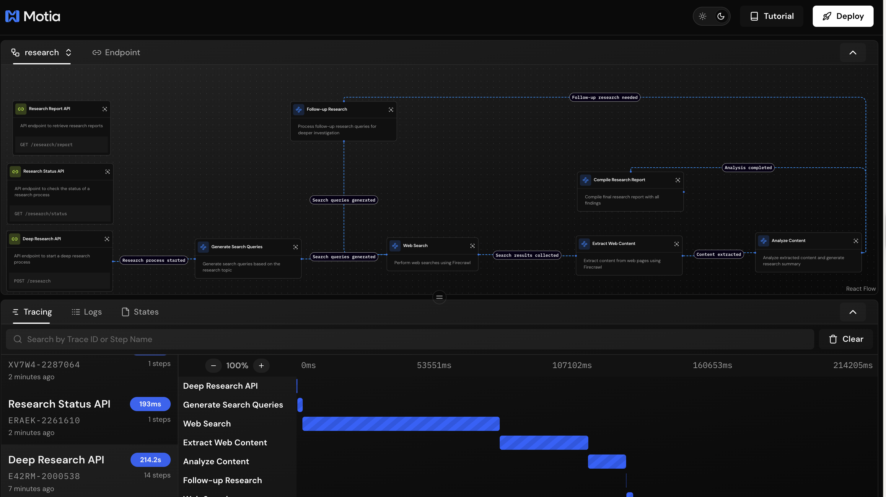
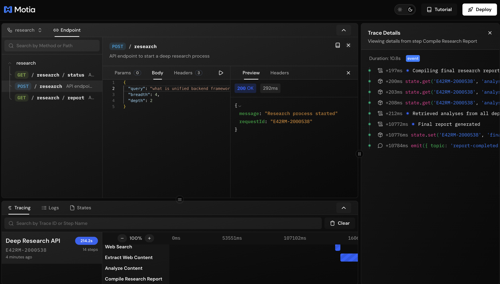
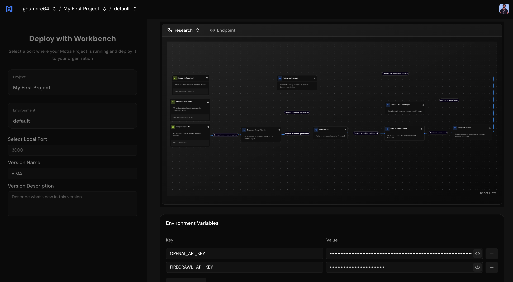
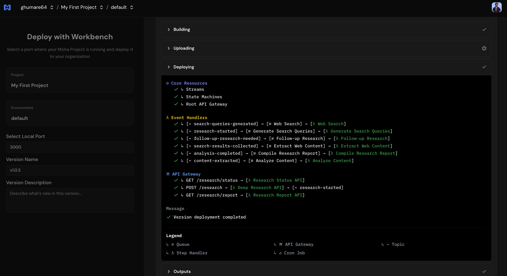

# 🔍 AI Deep Research Agent with Motia Framework

A powerful research assistant that leverages the Motia Framework to perform comprehensive web research on any topic. Get detailed, multi-source research reports with iterative depth exploration - all through simple API calls.



[](https://motia.dev)
[](LICENSE)
[](https://www.typescriptlang.org/)

## 📚 Table of Contents

- [✨ Features](#-features)
- [🔧 How It Works](#-how-it-works)
- [📋 Prerequisites](#-prerequisites)
- [🚀 Quick Start](#-quick-start)
- [📁 Project Structure](#-project-structure)
- [📡 API Usage](#-api-usage)
- [🧪 Quick Start Testing](#-quick-start-testing)
- [🔄 Event Flow](#-event-flow)
- [🛠️ Technologies Used](#️-technologies-used)
- [🌐 Deployment](#-deployment)
- [⚙️ Deployment Considerations](#️-deployment-considerations)
- [🔧 Troubleshooting](#-troubleshooting)
- [🤝 Contributing](#-contributing)
- [📜 License](#-license)

## ✨ Features

- 🌐 **Deep Web Research** - Automatically searches the web, extracts content, and synthesizes findings
- 🔄 **Iterative Research Process** - Supports multiple layers of research depth (1-5 levels)
- ⚡ **Event-Driven Architecture** - Built on Motia Framework's powerful event system
- 🚀 **Parallel Processing** - Efficiently processes multiple search results concurrently
- 🎯 **RESTful API** - Simple API endpoints for research management
- 💾 **Stateful Processing** - Maintains research state throughout the entire process
- 🛡️ **Production Ready** - Built-in rate limiting and message size handling
- 📊 **Detailed Reports** - Comprehensive reports with sources, key findings, and structured sections

## 🔧 How It Works

The Deep Research Agent orchestrates a sophisticated research workflow:

1. 📝 **Research Initiation** - Submit a research query via the API
2. 🧠 **Query Generation** - AI generates targeted search queries based on your topic
3. 🔍 **Web Search** - Performs intelligent web searches using Firecrawl
4. 📄 **Content Extraction** - Extracts and processes content from discovered sources
5. 🤖 **AI Analysis** - Analyzes content using OpenAI to generate insights
6. 🔁 **Follow-up Research** - Optionally dives deeper based on initial findings
7. 📋 **Report Compilation** - Generates comprehensive, structured research reports
8. ✅ **Result Retrieval** - Access your complete report via simple API call

## 📋 Prerequisites

Before you begin, ensure you have:

- ✅ **Node.js 18+** - [Download here](https://nodejs.org/)
- ✅ **OpenAI API Key** - [Get yours here](https://platform.openai.com/api-keys)
- ✅ **Firecrawl API Key** - [Sign up here](https://firecrawl.dev/)

## 🚀 Quick Start

### 1️⃣ Clone and Install

```bash
# Clone the repository
git clone https://github.com/MotiaDev/motia-examples/examples
cd examples/ai-deep-research-agent

# Install dependencies
npm install
```

### 2️⃣ Configure Environment

Create a `.env` file in the project root:

```bash
# Required API Keys
OPENAI_API_KEY=your-openai-api-key-here
FIRECRAWL_API_KEY=your-firecrawl-api-key-here

# Optional: Model Configuration
OPENAI_MODEL=gpt-4o

# Optional: Custom Firecrawl Instance
FIRECRAWL_API_URL=http://your-firecrawl-instance-url

# Optional: Rate Limiting (Recommended for Production)
FIRECRAWL_CONCURRENCY_LIMIT=2          # Number of concurrent requests (default: 2)
FIRECRAWL_BATCH_DELAY_MS=2000          # Delay between batches in ms (default: 2000)
```

### 3️⃣ Start Development Server

```bash
npm run dev
```

### 4️⃣ Access Workbench

Open your browser and navigate to: **http://localhost:3000**

🎉 **You're ready to start researching!**

## 📁 Project Structure

```
ai-deep-research-agent/
├── 📂 steps/                        # Motia workflow steps
│   ├── 🔌 research-api.step.ts      # API: Start research
│   ├── 📊 status-api.step.ts        # API: Check research status
│   ├── 📄 report-api.step.ts        # API: Get research report
│   ├── 🧠 generate-queries.step.ts  # Generate search queries
│   ├── 🔍 search-web.step.ts        # Perform web searches
│   ├── 📑 extract-content.step.ts   # Extract content from sources
│   ├── 🤖 analyze-content.step.ts   # AI content analysis
│   ├── 🔄 follow-up-research.step.ts # Deeper research iteration
│   └── 📋 compile-report.step.ts    # Compile final report
├── 📂 services/                     # External API integrations
│   ├── 🤖 openai.service.ts         # OpenAI GPT integration
│   └── 🔥 firecrawl.service.ts      # Firecrawl web scraping
├── 📂 docs/                         # Documentation assets
├── ⚙️ .env.example                  # Environment variables template
├── 📦 package.json                  # Project dependencies
└── 🔧 tsconfig.json                 # TypeScript configuration
```

## 📡 API Usage

### 🚀 Start Research

```bash
curl -X POST http://localhost:3000/research \
  -H "Content-Type: application/json" \
  -d '{
    "query": "What are the latest developments in quantum computing?",
    "breadth": 4,
    "depth": 2
  }'
```

**API Details:**
```
POST /research
Content-Type: application/json

{
  "query": "The research topic or question",
  "breadth": 4,  // Number of search queries to generate (1-10)
  "depth": 2     // Depth of research iterations (1-5)
}
```

**Response:**
```json
{
  "requestId": "unique-trace-id"
}
```

### 📊 Check Research Status

```bash
curl "http://localhost:3000/research/status?requestId=your-trace-id-here"
```

**API Details:**
```
GET /research/status?requestId=unique-trace-id
```

**Response:**
```json
{
  "message": "Research status retrieved successfully",
  "requestId": "unique-trace-id",
  "originalQuery": "The research topic or question",
  "status": "in-progress",
  "progress": {
    "currentDepth": 1,
    "totalDepth": 2,
    "percentComplete": 50
  },
  "reportAvailable": false
}
```



### 📄 Get Research Report

```bash
curl "http://localhost:3000/research/report?requestId=your-trace-id-here"
```

**API Details:**
```
GET /research/report?requestId=unique-trace-id
```

**Response:**
```json
{
  "message": "Research report retrieved successfully",
  "report": {
    "title": "Research Report Title",
    "overview": "Executive summary...",
    "sections": [
      {
        "title": "Section Title",
        "content": "Section content..."
      }
    ],
    "keyTakeaways": [
      "Key takeaway 1",
      "Key takeaway 2"
    ],
    "sources": [
      {
        "title": "Source Title",
        "url": "Source URL"
      }
    ],
    "originalQuery": "The research topic or question",
    "metadata": {
      "depthUsed": 2,
      "completedAt": "2025-03-18T16:45:30Z"
    }
  },
  "requestId": "unique-trace-id"
}
```

## 🧪 Quick Start Testing

Here's a complete workflow to test the Deep Research Agent:

### Step-by-Step Testing Guide

**1️⃣ Start Research:**
```bash
# Start a research session
curl -X POST http://localhost:3000/research \
  -H "Content-Type: application/json" \
  -d '{
    "query": "What are the benefits of renewable energy?",
    "breadth": 3,
    "depth": 2
  }'
```

**Response:**
```json
{
  "message": "Research process started",
  "requestId": "abc123-def456-ghi789"
}
```

**2️⃣ Check Status (copy the requestId from step 1):**
```bash
curl "http://localhost:3000/research/status?requestId=abc123-def456-ghi789"
```

**Response:**
```json
{
  "status": "in-progress",
  "progress": {
    "currentDepth": 1,
    "totalDepth": 2,
    "percentComplete": 50
  }
}
```

**3️⃣ Get Report (when status shows "completed"):**
```bash
curl "http://localhost:3000/research/report?requestId=abc123-def456-ghi789"
```

### 📊 Example Research Topics

Try these sample queries to see the agent in action:

```bash
# Technology Research
"What are the latest developments in quantum computing?"

# Health & Science
"What are the health benefits of intermittent fasting?"

# Business & Economics
"How is AI transforming the financial services industry?"

# Environment
"What are the most effective strategies for carbon capture?"

# Education
"What are the best practices for remote learning?"
```

> **Note**: The workflow supports iterative research - when analysis determines more depth is needed, it automatically triggers follow-up research with refined queries.

## 🛠️ Technologies Used

| Technology | Purpose | Version |
|------------|---------|---------|
| [Motia Framework](https://motia.dev) | Event-driven orchestration | Latest |
| [OpenAI API](https://platform.openai.com/) | AI-powered analysis & generation | gpt-4o |
| [Firecrawl](https://firecrawl.dev/) | Web scraping & search | Latest |
| [TypeScript](https://www.typescriptlang.org/) | Type-safe development | 5.8+ |
| [Zod](https://zod.dev/) | Runtime validation | 3.25+ |

## 🌐 Deployment

### Deploy to Motia Cloud

You can deploy your AI Deep Research Agent to Motia Cloud using either the CLI or the web interface.

#### Using the Motia CLI

Deploy with a specific version:

```bash
motia cloud deploy --api-key your-api-key-here --version-name 1.0.0
```

Deploy to a specific environment with environment variables:

```bash
motia cloud deploy --api-key your-api-key-here \
  --version-name 1.0.0 \
  --env-file .env.production \
  --environment-id env-id
```

#### Using the Web Interface

For a visual deployment experience, use the Motia Cloud web interface:

1. Have your local project running (`npm run dev`)
2. Go to **Import from Workbench** on [Motia Cloud](https://cloud.motia.dev)
3. Select the port your local project is running on (default: 3000)
4. Choose the project and environment name
5. Add environment variables:
   - `OPENAI_API_KEY`
   - `FIRECRAWL_API_KEY`
   - `FIRECRAWL_CONCURRENCY_LIMIT=1` (recommended for production)
   - `FIRECRAWL_BATCH_DELAY_MS=3000` (recommended for production)
6. Click **Deploy** and watch the magic happen! ✨




For detailed instructions, see the [Motia Cloud Deployment Guide](https://www.motia.dev/docs/deployment-guide/motia-cloud/deployment#using-web-interface).

## ⚙️ Deployment Considerations

When deploying to production environments, be aware of these important configurations:

### 📦 Message Size Limits

**AWS SNS has a 256KB message size limit.** This project automatically handles this:

- ✅ Truncates large content before emitting events (max 10,000 chars per content)
- ✅ Stores full content in state for complete analysis
- ✅ Retrieves full content from state during AI processing

> **No action needed** - this is handled automatically!

### ⏱️ Rate Limiting

**Firecrawl API has rate limits.** The project handles them intelligently:

| Feature | Configuration | Default |
|---------|--------------|---------|
| Concurrent Requests | `FIRECRAWL_CONCURRENCY_LIMIT` | 2 |
| Batch Delays | `FIRECRAWL_BATCH_DELAY_MS` | 2000ms |
| Automatic Retries | Built-in | 3 attempts |

### 🎯 Recommended Production Configuration

```env
# Conservative settings for stable production deployment
FIRECRAWL_CONCURRENCY_LIMIT=1           # Safer for rate limits
FIRECRAWL_BATCH_DELAY_MS=3000          # Longer delay between batches
OPENAI_MODEL=gpt-4o                     # Best quality results
```

## 🔧 Troubleshooting

<details>
<summary>❌ <strong>"Invalid parameter: Message too long"</strong></summary>

**Cause**: Content exceeds AWS SNS 256KB limit

**Solution**: ✅ Already fixed in the latest version! The code automatically truncates content. Make sure you're using the latest version of the code.

</details>

<details>
<summary>⚠️ <strong>"Status code: 429" (Rate Limit)</strong></summary>

**Cause**: Too many requests to Firecrawl API

**Solutions**:
1. Reduce `FIRECRAWL_CONCURRENCY_LIMIT` to `1`
2. Increase `FIRECRAWL_BATCH_DELAY_MS` to `3000-5000ms`
3. Reduce the `breadth` parameter in your research requests
4. Consider upgrading your Firecrawl plan

</details>

<details>
<summary>🔄 <strong>Research stuck in "in-progress"</strong></summary>

**Possible causes**:
- API rate limits exceeded
- Network timeout
- Invalid API keys

**Solutions**:
1. Check the logs in Motia Workbench
2. Verify your API keys are valid
3. Reduce breadth/depth parameters
4. Check your API quota limits

</details>

## 🤝 Contributing

We welcome contributions! Here's how you can help:

1. 🍴 Fork the repository
2. 🌿 Create your feature branch (`git checkout -b feature/amazing-feature`)
3. ✨ Make your changes
4. ✅ Test thoroughly
5. 💾 Commit your changes (`git commit -m 'Add amazing feature'`)
6. 📤 Push to the branch (`git push origin feature/amazing-feature`)
7. 🎉 Open a Pull Request

### Ideas for Contributions

- 🎨 Add support for more AI models (Anthropic, Gemini, etc.)
- 🌍 Add multi-language support
- 📊 Implement caching for repeated queries
- 🔧 Add more configuration options
- 📚 Improve documentation
- 🐛 Fix bugs and issues

## 📜 License

This project is licensed under the MIT License - see the [LICENSE](LICENSE) file for details.

## 🙏 Acknowledgments

- Built with [Motia Framework](https://motia.dev) - The event-driven orchestration platform
- Powered by [OpenAI](https://openai.com) for AI capabilities
- Web scraping by [Firecrawl](https://firecrawl.dev)

## 📞 Support

- 📖 **Documentation**: [Motia Docs](https://www.motia.dev/docs)
- 💬 **Community**: [Join our Discord](https://discord.gg/motia)
- 🐛 **Issues**: [GitHub Issues](https://github.com/MotiaDev/motia-examples/issues)
- 📧 **Email**: support@motia.dev

---

**Made with ❤️ by the Motia Community**
